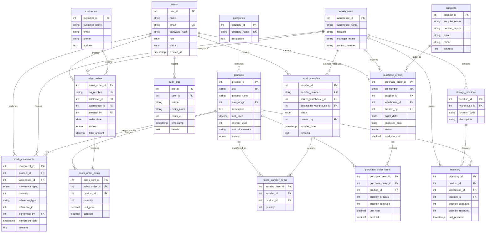

# Entity-Relationship (ER) Diagram
## Warehouse & Inventory Management System (DBMS Course Project)

```mermaid
erDiagram
    users ||--o{ purchase_orders : "creates"
    users ||--o{ sales_orders : "creates"
    users ||--o{ stock_transfers : "creates"
    users ||--o{ stock_movements : "performs"
    users ||--o{ audit_logs : "triggers"

    categories ||--o{ products : "classifies"

    warehouses ||--o{ storage_locations : "contains"
    warehouses ||--o{ inventory : "stores"
    warehouses ||--o{ purchase_orders : "receives"
    warehouses ||--o{ sales_orders : "dispatches_from"
    warehouses ||--o{ stock_transfers : "sources / receives"
    warehouses ||--o{ stock_movements : "houses"

    storage_locations ||--o{ inventory : "locates"

    suppliers ||--o{ purchase_orders : "supplies"

    customers ||--o{ sales_orders : "orders"

    products ||--o{ inventory : "stocked_as"
    products ||--o{ purchase_order_items : "ordered_in"
    products ||--o{ sales_order_items : "sold_in"
    products ||--o{ stock_transfer_items : "transferred_in"
    products ||--o{ stock_movements : "ledger_tracked"

    purchase_orders ||--|{ purchase_order_items : "contains"
    sales_orders ||--|{ sales_order_items : "contains"
    stock_transfers ||--|{ stock_transfer_items : "contains"

    users {
        int user_id PK
        string name
        string email UK
        string password_hash
        enum role
        enum status
        timestamp created_at
    }

    categories {
        int category_id PK
        string category_name UK
        text description
    }

    products {
        int product_id PK
        string sku UK
        string product_name
        int category_id FK
        text description
        decimal unit_price
        int reorder_level
        string unit_of_measure
        enum status
    }

    warehouses {
        int warehouse_id PK
        string warehouse_name
        string location
        string manager_name
        string contact_number
    }

    storage_locations {
        int location_id PK
        int warehouse_id FK
        string location_code
        string description
    }

    suppliers {
        int supplier_id PK
        string supplier_name
        string contact_person
        string email
        string phone
        text address
    }

    customers {
        int customer_id PK
        string customer_name
        string email
        string phone
        text address
    }

    inventory {
        int inventory_id PK
        int product_id FK
        int warehouse_id FK
        int location_id FK
        int quantity_available
        int quantity_reserved
        timestamp last_updated
    }

    purchase_orders {
        int purchase_order_id PK
        string po_number UK
        int supplier_id FK
        int warehouse_id FK
        int created_by FK
        date order_date
        date expected_date
        enum status
        decimal total_amount
    }

    purchase_order_items {
        int purchase_item_id PK
        int purchase_order_id FK
        int product_id FK
        int quantity_ordered
        int quantity_received
        decimal unit_cost
        decimal subtotal
    }

    sales_orders {
        int sales_order_id PK
        string so_number UK
        int customer_id FK
        int warehouse_id FK
        int created_by FK
        date order_date
        enum status
        decimal total_amount
    }

    sales_order_items {
        int sales_item_id PK
        int sales_order_id FK
        int product_id FK
        int quantity
        decimal unit_price
        decimal subtotal
    }

    stock_movements {
        int movement_id PK
        int product_id FK
        int warehouse_id FK
        enum movement_type
        int quantity
        string reference_type
        int reference_id
        int performed_by FK
        timestamp movement_date
        text remarks
    }

    stock_transfers {
        int transfer_id PK
        string transfer_number UK
        int source_warehouse_id FK
        int destination_warehouse_id FK
        enum status
        int created_by FK
        timestamp transfer_date
        text remarks
    }

    stock_transfer_items {
        int transfer_item_id PK
        int transfer_id FK
        int product_id FK
        int quantity
    }

    audit_logs {
        int log_id PK
        int user_id FK
        string action
        string entity_name
        int entity_id
        timestamp timestamp
        text details
    }
```
